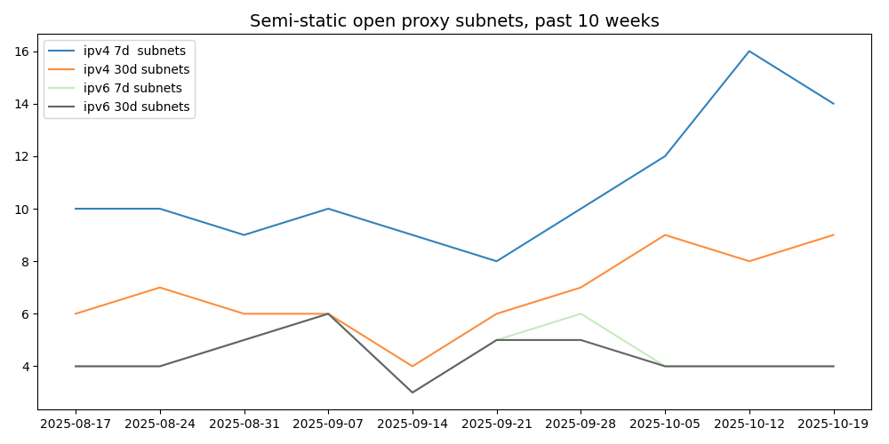
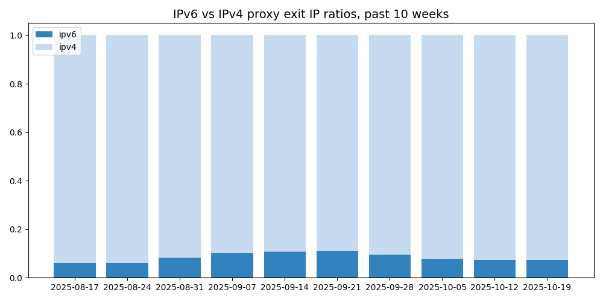

# semi-static-proxy-ips

Weekly CSV feeds of **semi-static open proxy exit IPs** (IPv4 + IPv6), plus **high-activity subnet** extracts.

Intended for **defensive workflows**: abuse mitigation, DNSBL/RBL tuning, monitoring, and research.

## Background

Companion dataset to [Open Proxy Life Expectancy (2022–2024)](https://mannfred.com/open-proxy-life-expectancy/).

"Semi-static" = proxies detectable long enough to be useful as a stability-filtered snapshot, vs. transient one-off detections.

## Definitions

| Term | Meaning |
|------|---------|
| **Exit IP** | Source address observed when a proxy relays traffic |
| **Entry IP** | Address of the proxy service contacted by the scanner |
| **Asymmetric proxy** | Entry and exit IP differ; entry IP recorded in comment column |

Entry ports and protocols are omitted to reduce misuse risk.

## Datasets

### Exit IPs

| File | Description |
|------|-------------|
| [`proxy_exits_7d_ipv4.csv`](./proxy_exits_7d_ipv4.csv) | IPv4 exits active ≥7 days |
| [`proxy_exits_7d_ipv6.csv`](./proxy_exits_7d_ipv6.csv) | IPv6 exits active ≥7 days |
| [`proxy_exits_30d_ipv4.csv`](./proxy_exits_30d_ipv4.csv) | IPv4 exits active ≥30 days |
| [`proxy_exits_30d_ipv6.csv`](./proxy_exits_30d_ipv6.csv) | IPv6 exits active ≥30 days |

### High-Activity Subnets

Subnets with ≥16 unique exit IPs:

| File | Description |
|------|-------------|
| [`proxy_subnets_7d_ipv4.csv`](./proxy_subnets_7d_ipv4.csv) | IPv4 /24s active ≥7 days |
| [`proxy_subnets_7d_ipv6.csv`](./proxy_subnets_7d_ipv6.csv) | IPv6 subnets active ≥7 days |
| [`proxy_subnets_30d_ipv4.csv`](./proxy_subnets_30d_ipv4.csv) | IPv4 /24s active ≥30 days |
| [`proxy_subnets_30d_ipv6.csv`](./proxy_subnets_30d_ipv6.csv) | IPv6 subnets active ≥30 days |

**Methodology:**
- IPv4: /24 bucketing
- IPv6: fitted dynamic prefix (/4 boundary) to capture dense exit ranges; limited to exits tied to specific entry IPs

## Statistics (last 10 weeks)

  
*Semi-static exit counts for ≥7d and ≥30d cohorts.*

  
*High-activity subnets (≥16 exits) by cohort.*

  
*IPv4 vs IPv6 composition.*

## Intended use

Defensive security research, measurement, monitoring, and abuse mitigation.

**Not** for circumventing safeguards or enabling malicious activity. If you believe something here creates unintended harm, please contact me.

## License

This data is provided as-is, without warranty. Use freely; attribution appreciated but not required.

## Contact

[mannfred.com](https://mannfred.com) · [mannfred@gmail.com](mailto:mannfred@gmail.com)
